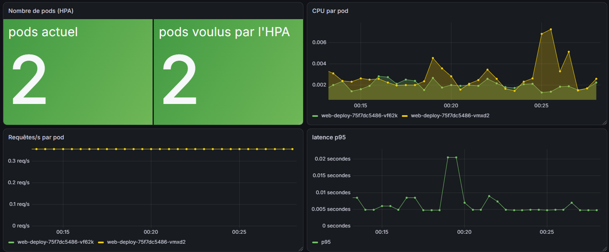
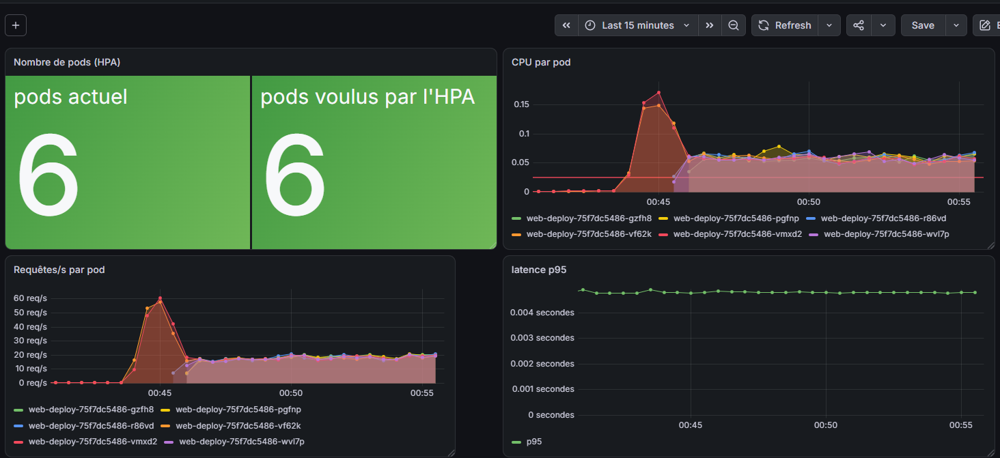

# podinfo-kubernetes — Déploiement, autoscaling et supervision d'un service sur Kubernetes

Déploiement d'un service web de démonstration ([podinfo](https://github.com/stefanprodan/podinfo)) sur un cluster **Kubernetes** local (**Minikube**) : Deployment multi-replicas avec probes de santé, Service avec répartition de charge, **autoscaling horizontal (HPA)**, rolling updates / rollback, et **supervision avec Prometheus et Grafana** installés via **Helm** (`kube-prometheus-stack`).

## Résultat : l'HPA en action

| Au repos (2 pods) | Sous charge (6 pods) |
| :---: | :---: |
|  |  |

Sous charge, le CPU des 2 pods initiaux dépasse l'objectif de l'HPA (ligne rouge : 50 % de la request CPU). L'HPA monte à 6 pods, la charge se répartit (~20 req/s par pod) et la latence p95 reste stable (~5 ms).

## Architecture

```text
                       ┌──────────────── namespace default ─────────────────┐
  load-gen (test) ───> │ Service web-svc ──> Pods web-deploy (2 à 6)        │
                       │      ▲                   ▲                         │
                       │      │ label app=web-app │ HPA web-hpa (CPU 50 %)  │
                       │ ServiceMonitor web-monitor   metrics-server        │
                       └──────┼─────────────────────────────────────────────┘
                              │ scrape /metrics (15 s)
                       ┌──────┼──────────── namespace monitoring ───────────┐
                       │ Prometheus (Operator) ──> Grafana (dashboard HPA)  │
                       │ kube-state-metrics · node-exporter                 │
                       └────────────────────────────────────────────────────┘
```

| Objet | Nom | Rôle |
| --- | --- | --- |
| Deployment | `web-deploy` | Maintient les pods podinfo (image `ghcr.io/stefanprodan/podinfo:6.15.0`) |
| Label | `app: web-app` | Lien entre Deployment, Service et ServiceMonitor |
| Service | `web-svc` | IP et nom DNS stables, répartition de charge entre les pods |
| HPA | `web-hpa` | Ajuste le nombre de pods (2 à 6) selon le CPU |
| ServiceMonitor | `web-monitor` | Indique à Prometheus de scraper `/metrics` des pods derrière `web-svc` |

## Structure

```text
podinfo-kubernetes/
├── k8s/
│   ├── deployment.yaml       # 2+ replicas, liveness/readiness probes, requests/limits
│   ├── service.yaml          # Service ClusterIP, port nommé "http"
│   ├── hpa.yaml              # HorizontalPodAutoscaler (2-6 pods, CPU 50 %)
│   └── servicemonitor.yaml   # Cible Prometheus (CRD du Prometheus Operator)
├── monitoring/
│   ├── values.yaml           # Configuration Helm de kube-prometheus-stack
│   └── dashboards/
│       └── web-app-hpa.json  # Dashboard Grafana (pods HPA, CPU, req/s, latence p95)
└── docs/                     # Captures du dashboard
```

## Déploiement

Prérequis : Docker, Minikube, kubectl, Helm.

```bash
# 1. Cluster local + metrics-server (nécessaire à l'HPA)
minikube start --driver=docker --memory=6144 --cpus=4
minikube addons enable metrics-server

# 2. Stack de supervision (installe aussi les CRD comme ServiceMonitor)
helm repo add prometheus-community https://prometheus-community.github.io/helm-charts
helm repo update
helm install monitoring prometheus-community/kube-prometheus-stack \
  -n monitoring --create-namespace -f monitoring/values.yaml

# 3. Application
kubectl apply -f k8s/
kubectl get pods -l app=web-app
kubectl get hpa web-hpa
```

Accès aux interfaces :

```bash
kubectl port-forward -n monitoring svc/monitoring-grafana 3000:80                       # Grafana (admin / admin)
kubectl port-forward -n monitoring svc/monitoring-kube-prometheus-prometheus 9090:9090  # Prometheus
```

Le dashboard s'importe depuis `monitoring/dashboards/web-app-hpa.json` (Dashboards → New → Import).

## Scénarios testés

| Scénario | Commande | Résultat observé |
| --- | --- | --- |
| Répartition de charge | `curl web-svc:9898` depuis un pod du cluster | Les réponses alternent entre les pods |
| Auto-réparation | `kubectl delete pod <pod>` | Le ReplicaSet recrée immédiatement un pod |
| Scaling manuel | `kubectl scale deployment web-deploy --replicas=4` | 4 pods, ajoutés automatiquement aux endpoints du Service |
| Rolling update | `kubectl set image deployment/web-deploy web-container=...:6.14.1` | Nouveau ReplicaSet, pods remplacés un par un, sans coupure |
| Rollback | `kubectl rollout undo deployment/web-deploy` | Retour à la version précédente (ancien ReplicaSet réactivé) |
| Readiness probe | `POST /readyz/disable` sur un pod | Pod `0/1` non redémarré, retiré des endpoints du Service |
| Autoscaling | Générateur de charge (voir ci-dessous) | CPU > 50 % → HPA de 2 à 6 pods, puis retour à 2 après ~5 min |

Test de charge :

```bash
kubectl create deployment load-gen --image=busybox:1.36 --replicas=3 -- \
  /bin/sh -c "while true; do wget -q -O- http://web-svc:9898 > /dev/null; done"
kubectl get hpa web-hpa -w
kubectl delete deployment load-gen
```

> Sous Git Bash (Windows), préfixer la commande par `MSYS_NO_PATHCONV=1` pour éviter la conversion de `/bin/sh` en chemin Windows.


## Pistes d'évolution

- Règles d'alerte Prometheus + Alertmanager
- Exposition via un Ingress

## Projets liés

- [prometheus-grafana-monitoring](https://github.com/ibrahimkh-cmd/prometheus-grafana-monitoring) — la même supervision avec Docker Compose
- [jeu-allumettes-devops](https://github.com/ibrahimkh-cmd/jeu-allumettes-devops) — Terraform, Ansible, CI/CD GitHub Actions
